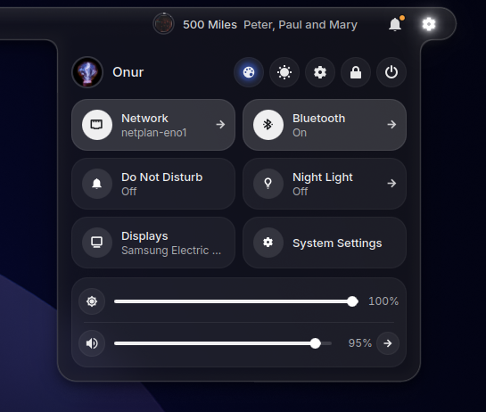
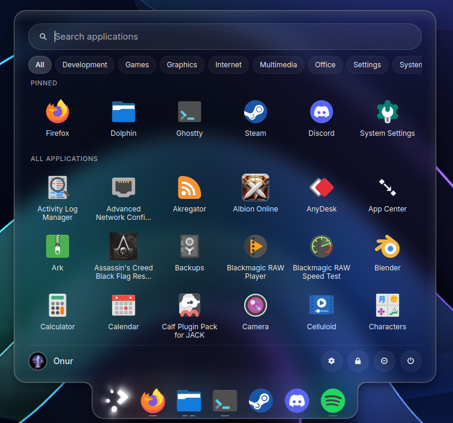
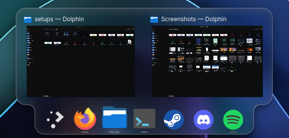
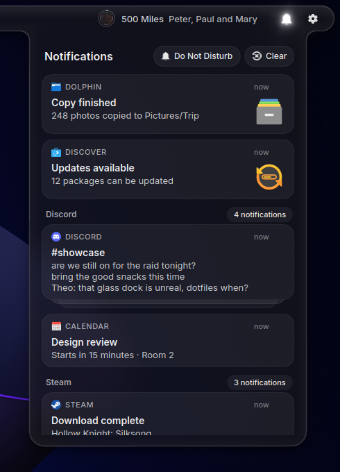
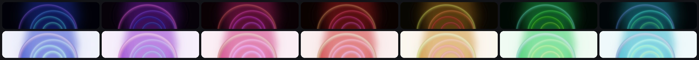

# Sirca Shell

A liquid-glass desktop shell for KDE Plasma 6 on Wayland: a top bar and a dock, with popups that grow out of them.
KWin stays the compositor; only Plasma's panels are replaced, and one command gives them back.


## A look around

| | |
|:--:|:--:|
|  |  |
| **Quick settings** grow out of the bar: network, Bluetooth, audio, brightness, Do Not Disturb, colour themes | **Launcher** grows out of the dock; Meta+Space searches apps, files, settings, sums and units |
|  |  |
| **Dock**: window previews with peek, per-window pills, badges, drag to reorder | **Notifications** with history, grouped per app, replies and progress |
|  |  |
| **Edit mode**: right-click the bar or dock. Drag widgets, resize, set blur, tint and haze per surface | **Tile picker** (Meta+A), screenshots and recording (Meta+Shift+S / R), clipboard history (Meta+V) |

### Light, dark and seven colours

One switch changes the shell, KDE and GTK apps, icons and the wallpaper together, as a single cross-fade.




### Apps in the same glass


Optional extras: a Spotify theme with a glass mini player, Firefox accent colours, Ghostty styling.


## Install

```
git clone https://github.com/onuroluc/sirca-shell.git
cd sirca-shell
./install.sh
```

The installer is interactive. It checks your system and tells you what will and will not work on it, explains the
risks of each part in plain words, and lets you choose: the shell only (no root), the shell with the matching look, or
the author's full setup. `./install.sh --dry-run` shows every command it would run and changes nothing.

```
sirca-shell-switch on      # saves your Plasma panels and hands over
sirca-shell-switch off     # your panels come back exactly as they were
./uninstall.sh             # removes what was installed, part by part
```

## What works, what does not (yet)

| | |
|---|---|
| KDE Plasma 6.6, Wayland, KWin | yes: built and used on it every day |
| X11, other compositors (Hyprland, Sway, GNOME) | no |
| One screen | yes |
| Several screens | not yet: the bar and dock are on the primary screen only |
| Without the KWin effect | works, but flat: translucent surfaces without blur or the lit edge |
| NVIDIA | developed on it. AMD and Intel are untested by the author; reports welcome |
| After a Plasma upgrade | the shell keeps working; the KWin effect must be rebuilt (run `./install.sh` again) |

This is young software by one person, used daily on one machine. Expect rough edges elsewhere, and please report them.

## In this repository

| folder | what |
|---|---|
| `shell/` | the shell (C++ / QML). Its README has every feature, the settings, scripting and the build dependencies |
| `kwin-effects/` | the glass KWin effect (blur, refraction, lit edge, shapes described by the shell) and Glass Key (glass inside apps that paint opaque windows) |
| `desktop/` | the look for everything else: KDE colour scheme, GTK 3 / 4, Qt style and window decoration, `glass-mode` (light / dark, colour themes), lock screen, app extras |
| `wallpapers/` | one original picture in seven colours, dark and light |
| `setups/` | the colour themes, and the author's bar and dock layout as a file for `sirca-shell-setup import` |

## Licence and credits

GPL-3.0-or-later for everything written for this project, see `LICENSE`. Each folder keeps the notices of what it builds on:

- `kwin-effects/` is a fork of **kwin-effects-glass** by 4v3ngR, itself a fork of KWin's blur effect (KDE) by way of Better Blur; GPL-3.0.
- `desktop/qt/darkly-fork/` is a fork of **Darkly** (itself a fork of Lightly / Breeze), GPL-2.0-or-later; see its `COPYING`.
- `desktop/third_party/adw-gtk3/` is **adw-gtk3** by lassekongo83, LGPL-2.1.
- `shell/qml/control/` derives from **Plasma Control Hub** by zayronxio; `shell/applets/` holds forks of KDE Plasma applets (their headers are kept).
- Fonts: **Outfit** and **Inter**, SIL Open Font License. Icons are not bundled; the look assumes Papirus.

Thank you to all of them.
